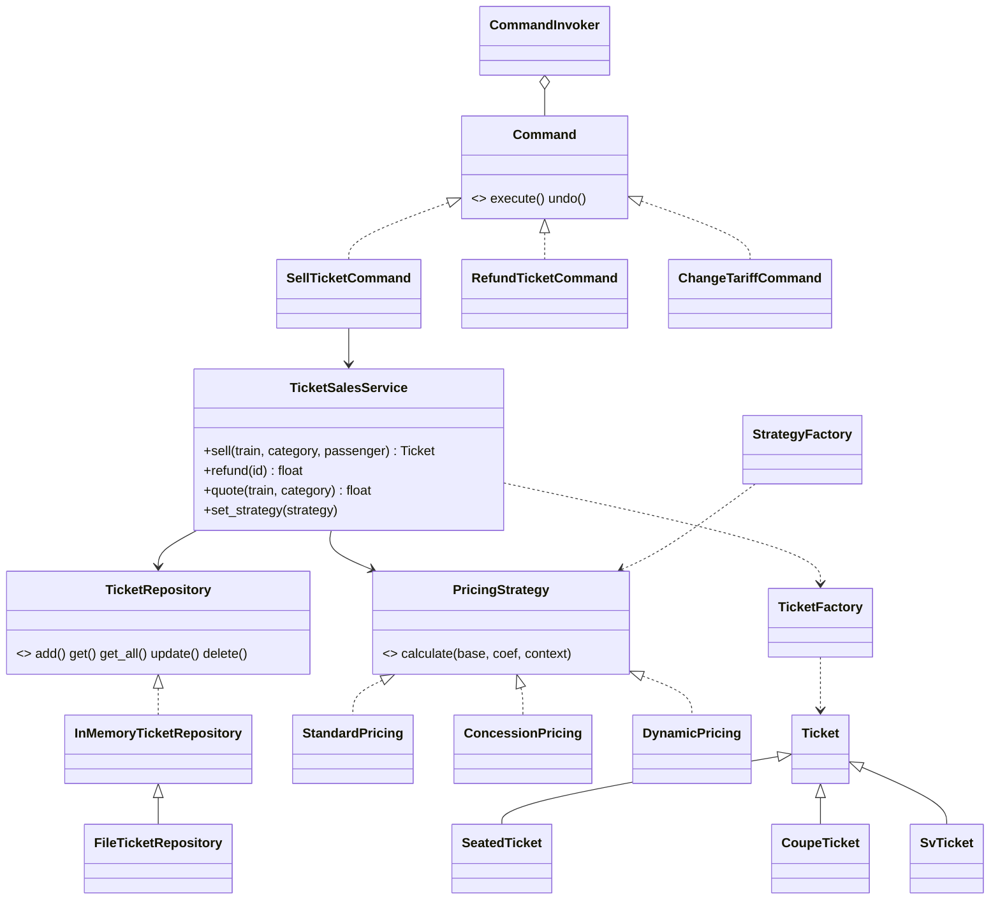

# ЛР №8 — Паттерны проектирования

**Вариант 10. Железнодорожные перевозки — система продажи билетов.**
Factory: сидячий / купе / СВ. Strategy: стандартный / льготный / динамический тариф. Дополнительный паттерн: Command.

* `naive/naive_sales.py` — наивная реализация (if/elif везде).
* `app/` — итоговая версия: `python main.py`, тесты `python -m pytest -v` (14 тестов).

## Анализ и выбор паттернов

| Проблема наивной версии | Паттерн | Классы | Результат |
|---|---|---|---|
| Создание билета `if wagon == "seated" ... elif "sv"` в нескольких местах | **Factory** | `TicketFactory`, `SeatedTicket`, `CoupeTicket`, `SvTicket` | Создание в одном месте; новый тип — `TicketFactory.register()` |
| Выбор тарифа через `if tariff == ...` внутри расчёта цены | **Strategy** | `PricingStrategy`, `StandardPricing`, `ConcessionPricing`, `DynamicPricing` | Тариф меняется «на лету» без изменения сервиса |
| Данные лежат в списке внутри сервиса | **Repository** | `TicketRepository`, `InMemoryTicketRepository`, `FileTicketRepository` | Сервис не знает о способе хранения; выбор хранилища при запуске |
| Команды меню через `if command == ...`, нет истории и отмены | **Command** | `SellTicketCommand`, `RefundTicketCommand`, `ChangeTariffCommand`, `CommandInvoker` | История операций и `undo()` |
| Тариф выбирается пользователем по строке | **Factory + Strategy** | `StrategyFactory` | UI не знает конкретных классов стратегий |

Недостатки: больше классов и файлов; для двух-трёх вариантов `if` проще. Здесь паттерны оправданы,
потому что типов вагонов и тарифов несколько и они будут расширяться, а отмена операций — реальное требование кассы.

## Диаграмма классов

| Критерий | До | После |
|---|---|---|
| Создание объектов | if/elif | Factory |
| Выбор алгоритма | if/elif | Strategy |
| Хранение данных | внутри сервиса | Repository (память/файл) |
| Операции | условная логика | Command + undo |
| Тестируемость | нет тестов | 14 тестов |
